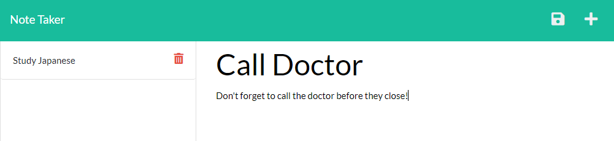

# Note Taker App

 
  
## Description
My motivation for this project was to create an app for keeping track of habits and notes. The Note Taker App keeps it simple for you to update your information for the day/week/month. I learned how to connect to the local host using express and node.

## Table of Contents

- [Installation](#installation)
- [Usage](#usage)
- [Credits](#credits)
- [License](#license)

## Installation

To install the project, you must have vs code, install node and install express.

## Usage

You use this project by giving your note a title and keeping track of all your notes. Add a new one by clicking the plus button and push the disk to save.

    

## Credits

## License

## Questions

Please reach out to me on my [GitHub](github.com/wolaki96) or my email at wolaki96@gmail.com if you have any questions!

